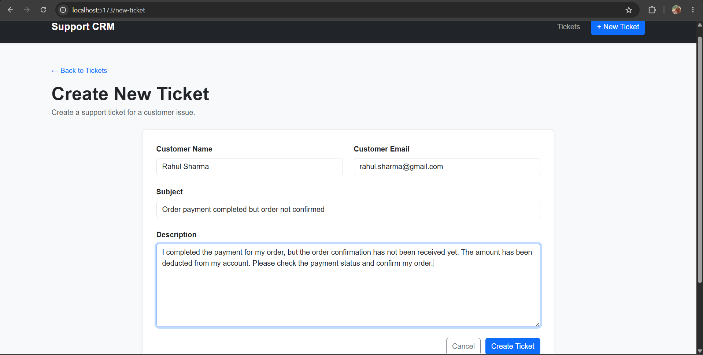
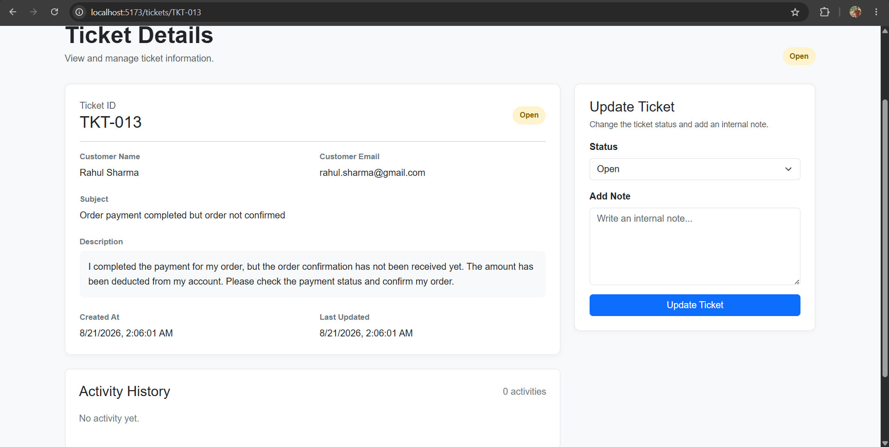
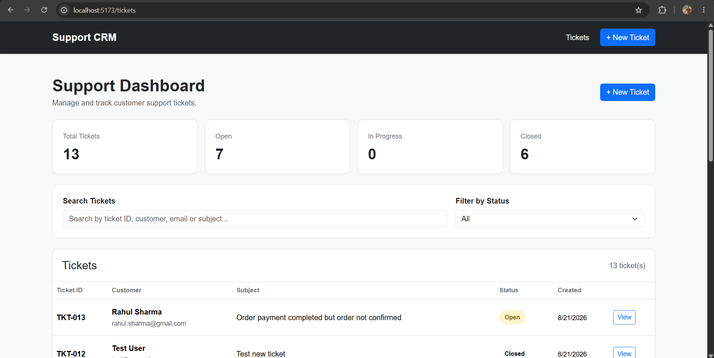
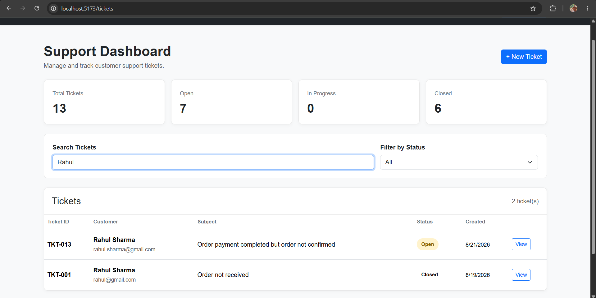
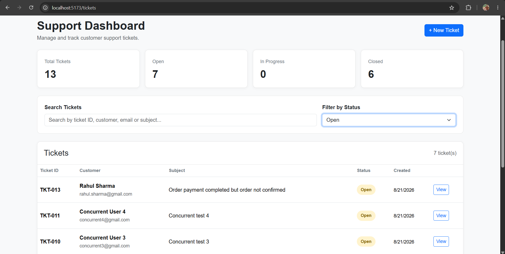
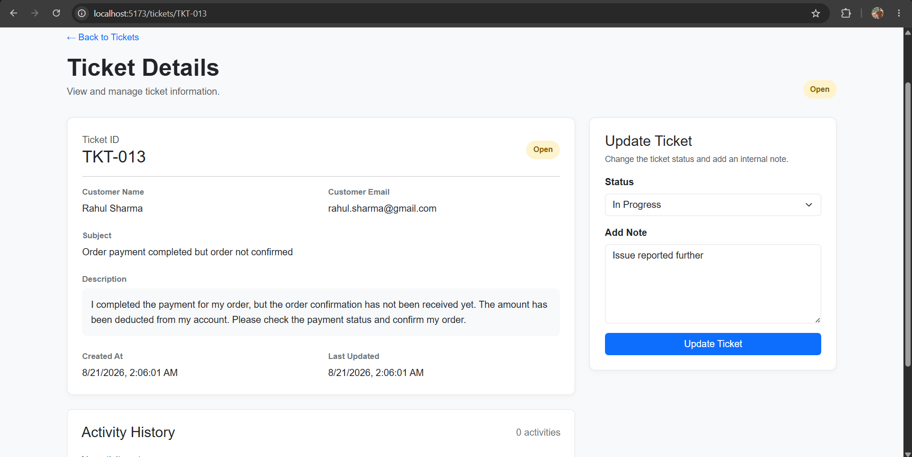
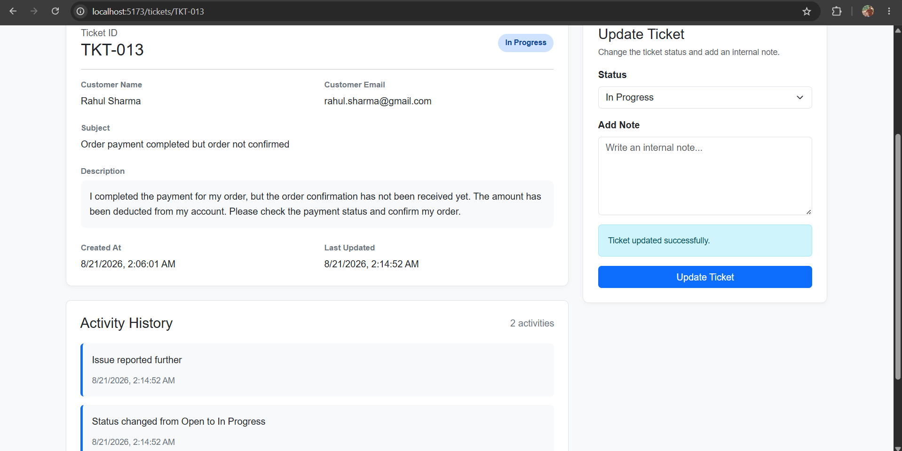
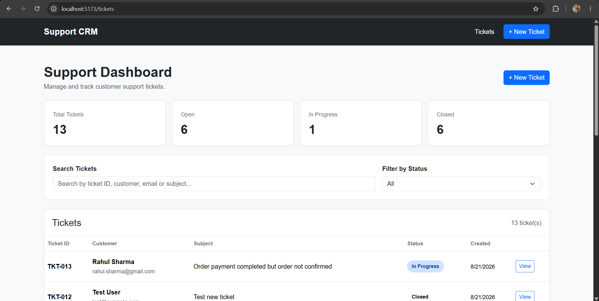

# Support CRM

A full-stack customer support ticket management system built using the MERN stack.

Support CRM allows support teams to create, manage, search, filter, and update customer support tickets through a centralized dashboard.

---

## Features

- Create new support tickets
- Automatically generate unique ticket IDs
- View all support tickets
- View detailed ticket information
- Search tickets by:
  - Ticket ID
  - Customer name
  - Customer email
  - Subject
- Filter tickets by status
- Update ticket status
- Add internal notes
- Maintain ticket activity history
- Dashboard statistics
- Responsive user interface
- REST API based backend
- MongoDB database integration

---

## Tech Stack

### Frontend

- React.js
- React Router
- Axios
- Bootstrap
- CSS
- Vite

### Backend

- Node.js
- Express.js
- MongoDB
- Mongoose
- REST API

### Development Tools

- Visual Studio Code
- Git
- GitHub
- MongoDB Atlas

---

## Project Structure

```text
support-crm/
│
├── backend/
│   ├── controllers/
│   ├── models/
│   ├── routes/
│   ├── middleware/
│   ├── app.js
│   ├── package.json
│   └── .env
│
├── frontend/
│   ├── src/
│   │   ├── components/
│   │   ├── pages/
│   │   ├── App.jsx
│   │   └── main.jsx
│   ├── package.json
│   └── .env
│
├── screenshots/
│   ├── create-ticket.png
│   ├── ticket-details.png
│   ├── dashboard.png
│   ├── search-tickets.png
│   ├── filter-tickets.png
│   ├── before-update.png
│   ├── after-update.png
│   └── after-dashboard.png
│
├── .gitignore
└── README.md
```

---

## Application Workflow

```text
Create Ticket
      ↓
Ticket Created
      ↓
View Ticket Details
      ↓
Search / Filter Tickets
      ↓
Update Ticket Status
      ↓
Add Internal Note
      ↓
Activity History Updated
      ↓
Dashboard Statistics Updated
```

---

## Main Features

### 1. Create New Ticket

Support staff can create a new support ticket by entering:

- Customer name
- Customer email
- Subject
- Description

A unique ticket ID and timestamp are generated automatically.

### 2. Support Dashboard

The dashboard provides an overview of the support ticket workload.

It displays:

- Total Tickets
- Open Tickets
- In Progress Tickets
- Closed Tickets

The dashboard also provides search and status filtering functionality.

### 3. Search Tickets

Tickets can be searched using:

- Ticket ID
- Customer name
- Customer email
- Subject

Search results are updated dynamically as the user types.

### 4. Filter Tickets

Tickets can be filtered according to their current status.

Available statuses:

- All
- Open
- In Progress
- Closed

Search and filtering can be used together to quickly find relevant tickets.

### 5. Ticket Details

Each ticket has a dedicated details page containing:

- Ticket ID
- Customer name
- Customer email
- Subject
- Description
- Current status
- Created date
- Updated date
- Internal notes
- Activity history

### 6. Update Ticket

Support staff can update the status of a ticket and add an internal note.

Available statuses:

- Open
- In Progress
- Closed

After an update, the ticket information and dashboard statistics are refreshed.

### 7. Activity History

Ticket updates and internal notes are displayed in the activity history.

This provides a record of changes made to each ticket and helps support staff track the progress of an issue.

---

## Screenshots

### 1. Create New Ticket

Users can create a new support ticket by entering the customer's name, email, subject, and issue description.



### 2. Ticket Details

The ticket details page displays complete information about a selected ticket, including customer information, description, status, notes, and activity history.



### 3. Support Dashboard

The dashboard displays ticket statistics, search, filtering, and the list of support tickets.



### 4. Search Tickets

Users can search for tickets using ticket ID, customer name, customer email, or subject.



### 5. Filter Tickets

Users can filter tickets based on their current status.



### 6. Before Ticket Update

The ticket details page before changing the ticket status or adding an internal note.



### 7. After Ticket Update

After updating the ticket, the new status and internal note are reflected in the ticket activity history.



### 8. Updated Dashboard

The dashboard statistics are updated after the ticket status changes.



---

## Ticket Status Flow

```text
Open
  ↓
In Progress
  ↓
Closed
```

---

## REST API

The React frontend communicates with the Express backend using REST APIs.

### Create Ticket

```http
POST /api/tickets
```

Example request:

```json
{
  "customer_name": "Rahul Sharma",
  "customer_email": "rahul@gmail.com",
  "subject": "Order payment completed but order not confirmed",
  "description": "Payment was deducted but the order confirmation was not received."
}
```

### Get All Tickets

```http
GET /api/tickets
```

Returns all available support tickets.

### Get Ticket Details

```http
GET /api/tickets/:ticketId
```

Returns detailed information for a specific ticket.

### Update Ticket

```http
PUT /api/tickets/:ticketId
```

Example request:

```json
{
  "status": "In Progress",
  "notes": "Issue reported to the concerned team."
}
```

### Get Ticket Notes

```http
GET /api/notes/:ticketId
```

Returns notes associated with a specific ticket.

---

## Database

MongoDB is used to store support ticket and note information.

### Ticket Information

Each ticket contains:

- Ticket ID
- Customer name
- Customer email
- Subject
- Description
- Status
- Created date
- Updated date

### Notes

Notes are associated with their respective tickets and contain:

- Ticket ID
- Note text
- Created date

---

## Installation and Setup

### Prerequisites

Make sure the following are installed:

- Node.js
- npm
- MongoDB or MongoDB Atlas
- Git

### Backend Setup

Navigate to the backend directory:

```bash
cd backend
```

Install dependencies:

```bash
npm install
```

Create a `.env` file inside the `backend` directory:

```env
MONGO_URI=your_mongodb_connection_string
PORT=5000
```

Start the backend server:

```bash
npm run dev
```

The backend runs on:

```text
http://localhost:5000
```

### Frontend Setup

Open another terminal and navigate to the frontend directory:

```bash
cd frontend
```

Install dependencies:

```bash
npm install
```

Start the frontend:

```bash
npm run dev
```

The frontend runs on:

```text
http://localhost:5173
```

---

## Environment Variables

Environment variables are used for sensitive configuration such as the MongoDB connection string.

Example:

```env
MONGO_URI=your_mongodb_connection_string
PORT=5000
```

The actual `.env` file should not be committed to GitHub.

---

## Responsive Design

The application is designed to work across different screen sizes, including:

- Desktop
- Laptop
- Tablet
- Mobile

The dashboard, ticket forms, ticket details, search, and filtering interfaces use responsive layouts.

---

## Assignment Requirements

| Requirement | Status |
|---|---|
| Full-stack web application | ✅ |
| Database | ✅ MongoDB |
| Backend API | ✅ Node.js + Express |
| Frontend | ✅ React |
| Create tickets | ✅ |
| Auto-generated ticket ID | ✅ |
| List tickets | ✅ |
| Search tickets | ✅ |
| Filter by status | ✅ |
| View ticket details | ✅ |
| Update ticket status | ✅ |
| Add notes/comments | ✅ |
| Activity history | ✅ |
| Responsive UI | ✅ |

---

## Future Improvements

Possible future enhancements include:

- User authentication
- Role-based access control
- Support agent assignment
- Ticket priority
- Pagination
- Email notifications
- File attachments
- Customer communication history
- Advanced analytics and reporting
- SLA tracking
- AI-powered ticket categorization
- AI-powered ticket summarization

---

## Author

**Harshvardhan Gupta**

Computer Engineering Graduate

GitHub: https://github.com/harshgupta73